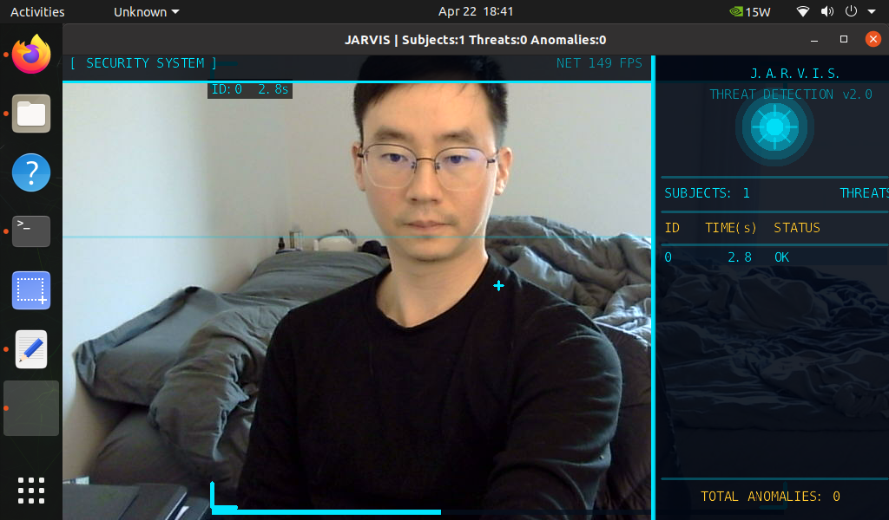
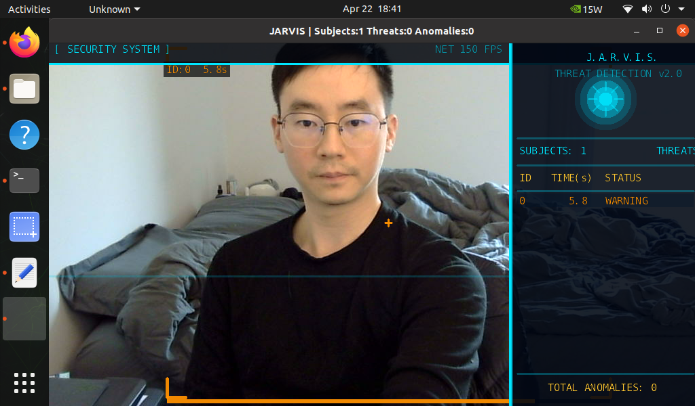
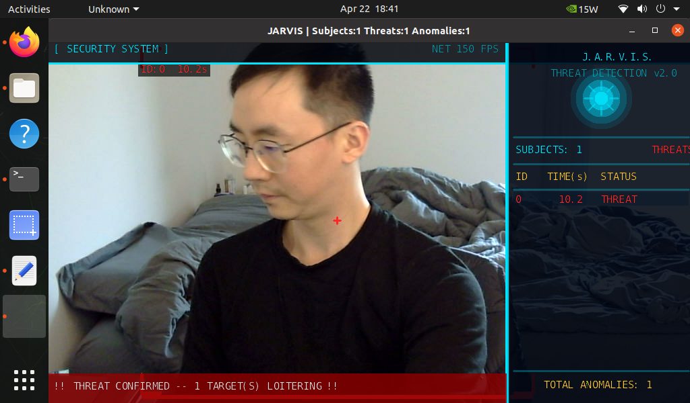

# loitering-detector

> Theme: Iron Man / Stark Industries

A real-time loitering detection system running on the NVIDIA Jetson Nano. Styled after Tony Stark's J.A.R.V.I.S. interface, the system monitors a live camera feed, tracks individuals using IOU object tracking, and flags anyone who remains in frame beyond a configurable time threshold.

---

## Screenshots

| State | Screenshot |
|-------|-----------|
| Normal — cyan brackets, OK status |  |
| Warning — amber brackets, approaching threshold |  |
| Threat confirmed — red brackets, alert banner |  |

---

## Results

The system successfully detected and flagged loitering in all test runs.
- Default threshold: 7 seconds
- Detection model: ssd-mobilenet-v2 (~150 FPS on Jetson Nano with TensorRT)
- Tracking: IOU multi-object tracker with persistent TrackIDs
- All three alert states (OK, WARNING, THREAT) confirmed working via live camera

---

## UI Design — Iron Man / J.A.R.V.I.S. Theme

The display is split into two zones:

```
┌─────────────────────────────────┬───────────────────────┐
│[ SECURITY SYSTEM ]     NET N FPS│← top HUD bar          │
├─────────────────────────────────┼───────────────────────┤
│                                 │   J.A.R.V.I.S.        │
│                                 │ THREAT DETECTION v2.0 │
│                                 │   (arc reactor gfx)   │
│    LIVE CAMERA FEED             ├───────────────────────┤
│                                 │SUBJECTS: N THREATS: N │
│    [ targeting brackets ]       ├───────────────────────┤
│    ID:xx  xx.xs                 │ ID  TIME(s)  STATUS   │
│    [===progress bar====]        │ 42   12.3    THREAT   │
│                                 │ 17    4.1    WARNING  │
│                                 │ 8     1.2    OK       │
│                                 ├───────────────────────┤
│  !! THREAT CONFIRMED !!  (blink)│  TOTAL ANOMALIES: N   │
└─────────────────────────────────┴───────────────────────┘
```

| UI Element | Description |
|---|---|
| Top HUD bar | System name + live FPS |
| Iron Man bracket reticles | Corner-only brackets with center crosshair, color-coded by state |
| Progress bar | Thin bar below each bounding box filling as dwell time increases |
| Animated scan line | Horizontal line sweeping top-to-bottom in camera area |
| Right panel | Dark navy semi-transparent panel with arc reactor decoration |
| J.A.R.V.I.S. header | System name + subtitle in JARVIS cyan |
| Arc reactor graphic | Concentric layered circles with radial spokes |
| Stats row | Live subject count and threat count |
| Tracking table | Live-updating rows: ID / elapsed time / status, sorted by dwell time |
| Alert banner | Blinking red banner at bottom when loitering is confirmed |

### Color Coding

| Color | State | Meaning |
|---|---|---|
| Cyan | OK | Person detected, timer running, below 60% of threshold |
| Amber | WARNING | Between 60% and 100% of threshold |
| Red | THREAT | Loitering confirmed — anomaly detected |
| Gold | Headers | Table column labels and footer |

---

## How It Works

1. **Object Detection** — `ssd-mobilenet-v2` (MS-COCO, TensorRT optimized) runs inference on every camera frame and returns bounding boxes for all detected `person` objects.

2. **Object Tracking** — IOU-based multi-object tracking assigns persistent `TrackID` values to each person, maintained across frames even through brief occlusions.

3. **Loitering Logic** — A dictionary maps each `TrackID` to its first-seen timestamp. Every frame:
   - `elapsed = current_time - first_seen[TrackID]`
   - `elapsed >= threshold` → anomaly flagged, row turns red, alert banner appears

```
DETECTED
   |
   v
[CYAN — OK]         0s to 60% of threshold
   |
   v
[AMBER — WARNING]   60% to 100% of threshold
   |
   v
[RED — THREAT]      > threshold seconds  --> anomaly logged
```

---

## Hardware & Software

| Component | Details |
|-----------|---------|
| Hardware | NVIDIA Jetson Nano Developer Kit |
| Camera | USB camera, V4L2 (`/dev/video0`) |
| Container | `dustynv/jetson-inference:r35.4.1` |
| Model | `ssd-mobilenet-v2`, 91-class MS-COCO, TensorRT |
| Tracking | IOU (Intersection-over-Union) built into jetson-inference |
| Display | HDMI via OpenGL output (`display://0`) |

---

## Setup & Running

### 1. Start the Docker Container

```bash
docker run --runtime nvidia -it --rm \
  --network host \
  --volume /tmp/.X11-unix:/tmp/.X11-unix \
  --env DISPLAY=$DISPLAY \
  --device /dev/video0 \
  dustynv/jetson-inference:r35.4.1
```

### 2. Copy the script in

From the Jetson host (outside Docker):
```bash
docker cp loitering_detector.py $(docker ps -q):/home/
```

### 3. Run

```bash
python3 /home/loitering_detector.py
```

> First run takes 2–3 minutes while TensorRT compiles and caches the model engine.

### Optional arguments

```bash
# Lower threshold for faster testing
python3 loitering_detector.py --threshold 3.0

# Save output to file
python3 loitering_detector.py --output output.mp4

# Different camera
python3 loitering_detector.py --input /dev/video1
```

---

## Configuration

Edit the constants at the top of the script:

```python
LOITER_THRESHOLD  = 7.0   # seconds before flagging (increase for fewer false positives)
WARNING_RATIO     = 0.6   # fraction of threshold where box turns amber (0.0–1.0)
CONFIDENCE_THRESH = 0.50  # detection confidence cutoff (lower = more detections, more noise)
TRACK_DROP_FRAMES = 15    # frames of no detection before dropping a track
PANEL_WIDTH       = 280   # width of the right-side info panel in pixels
```

---

## Key API Used

```python
# Enable IOU tracking
net.SetTrackingEnabled(True)
net.SetTrackingParams(minFrames=3, dropFrames=15, overlapThreshold=0.5)

# Per-detection tracking fields (all plain float/int attributes, NOT methods)
det.TrackID       # persistent int ID for this person across frames
det.TrackStatus   # >= 0: actively tracked;  -1: track lost, will be dropped
det.TrackFrames   # how many frames this track has been alive
det.Width         # float — NOT det.Width() — it is a property, not a method
det.Height        # same

# Drawing
jetson_utils.cudaDrawRect(img, (x1, y1, x2, y2), (R, G, B, A))
jetson_utils.cudaDrawLine(img, (x1, y1), (x2, y2), (R, G, B, A), thickness)
jetson_utils.cudaDrawCircle(img, (cx, cy), radius, (R, G, B, A))
font = jetson_utils.cudaFont()
font.OverlayText(img, img.width, img.height, text, x, y, fg_color, bg_color)
# Note: cudaFont does NOT support Unicode — use plain ASCII only
```

---

## File Structure

```
loitering-detector/
├── loitering_detector.py   # Main script
├── README.md               # This file
└── images/
    ├── normal.jpg           # Cyan brackets — subjects being tracked
    ├── warning.jpg          # Amber brackets — approaching threshold
    └── anomaly.jpg          # Red brackets + blinking alert banner
```

---

## References

- [dusty-nv/jetson-inference](https://github.com/dusty-nv/jetson-inference)
- [detectNet camera streaming](https://github.com/dusty-nv/jetson-inference/blob/master/docs/detectnet-camera-2.md)
- [Object tracking docs](https://github.com/dusty-nv/jetson-inference/blob/master/docs/detectnet-tracking.md)
